# Hi there, I'm Kavindu Sahan (bl4ckf0xk) 👋

## 🚀 About Me
I'm a passionate Cyber Security enthusiast, Cryptography learner, and a Front-End Developer on a mission to build secure and innovative digital solutions.

---

### 🔭 I’m currently working on:
- Honing my skills in various Cyber Security domains.
- Developing personal projects to apply and showcase my learning.
<!-- 👩‍💻 Add more details about your current projects here -->

---

### 🌱 I’m currently learning:
- Advanced Reverse Engineering techniques
- AI & Blockchain Security principles
- Deepening my understanding of Cryptography
<!-- 🧠 Share more about your learning journey -->

---

### 👯 I’m looking to collaborate on:
- Open-source Cyber Security projects
- Innovative web development projects with a security focus
<!-- 👯‍♀️ Specify the types of projects you're excited to collaborate on -->

---

### 🤝 Connect with me:

  
  
  
      
<a class="libutton" href="https://www.linkedin.com/comm/mynetwork/discovery-see-all?usecase=PEOPLE_FOLLOWS&followMember=kavindu-sahan" target="_blank">Follow on LinkedIn</a>

<!-- 📫 Add other ways to reach you if any -->

---

### 📊 GitHub Stats

  

---

  <em>Pronouns: bl4ckf0xk</em>

